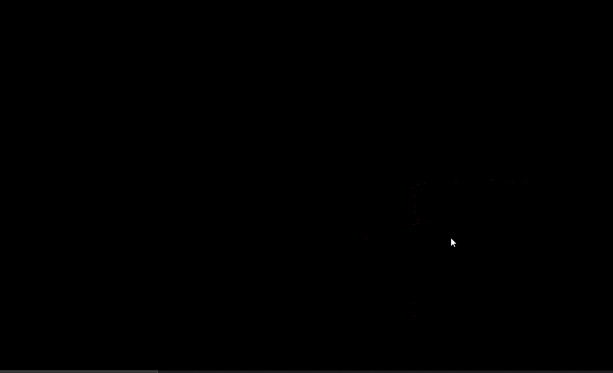
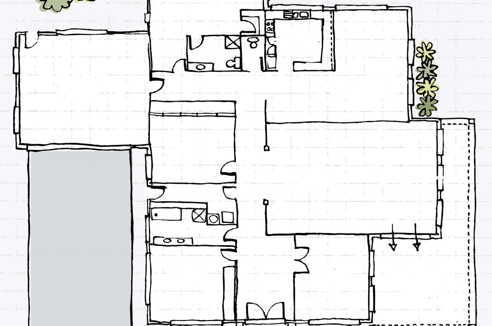

# 2d simulation of SLAM

# Original map

# This project implement a 2D simulation of Simulataneous Localisation And Maping (SLAM)

# How to run it ?

1 create a virtual environnement 

2 install the requirements.txt

3 and run the main.py

4 and moove your mouse arround the window

## The original tutorial can be foun [here](https://www.youtube.com/watch?v=JbUNsYPJK1U&ab_channel=Algobotics)

